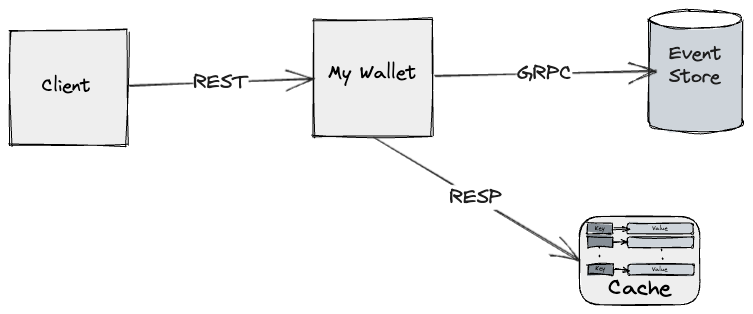

# Project Overview
My Wallet: Digital Wallet with Event Sourcing Integration

"My Wallet" is a digital wallet backend application developed using **NestJS** and **TypeScript**. Designed with simplicity in mind, it offers two core REST endpoints: one for saving a transaction and another to check the balance. This application integrates with EventStoreDB to implement the **event-sourcing** approach.

## Key Technologies & Concepts:
[NestJS](https://nestjs.com/)  
[TypeScript](https://www.typescriptlang.org/)  
[Event Sourcing](https://www.eventstore.com/event-sourcing#:~:text=Event%20Sourcing%20is%20an%20architectural,effective%20architecture%20for%20their%20needs.)  
[Event Store DB](https://www.eventstore.com/)  
[Redis](https://redis.io/)  
[Decorator Pattern](https://refactoring.guru/design-patterns/decorator)  
[Jest](https://jestjs.io/pt-BR/)  
[Docker](https://www.docker.com/)  
[Docker Compose](https://docs.docker.com/compose/)

## Project Purpose:
"My Wallet" serves as a practical illustration of event sourcing within a digital wallet scenario. By integrating with EventStoreDB, it is aimed to demonstrate the strengths and potential of the event sourcing paradigm in financial domain applications, emphasizing its utility even in simpler systems like "My Wallet".


## System Design


## Running the Application with Docker
1. **Install Docker**:
If you don't have Docker installed, download it from Docker official website and follow the installation instructions.

2. **Clone the Repository**:
```
git clone https://github.com/eduardogomesf/my-wallet.git
cd my-wallet
```

3. **Setup envs**:
Create a .env file in the root of the project and copy the variables from the .env.example file

4. **Build and Start the Docker Containers**:
```
npm run up # This will build the Docker image and start the containers in detached mode using the docker-compose configuration.
```

x. **Stopping the Docker Containers**:
If you want to stop the Docker containers:
```
npm run down
```

---
🛠️ Created by [eduardogomesf](https://github.com/eduardogomesf)
